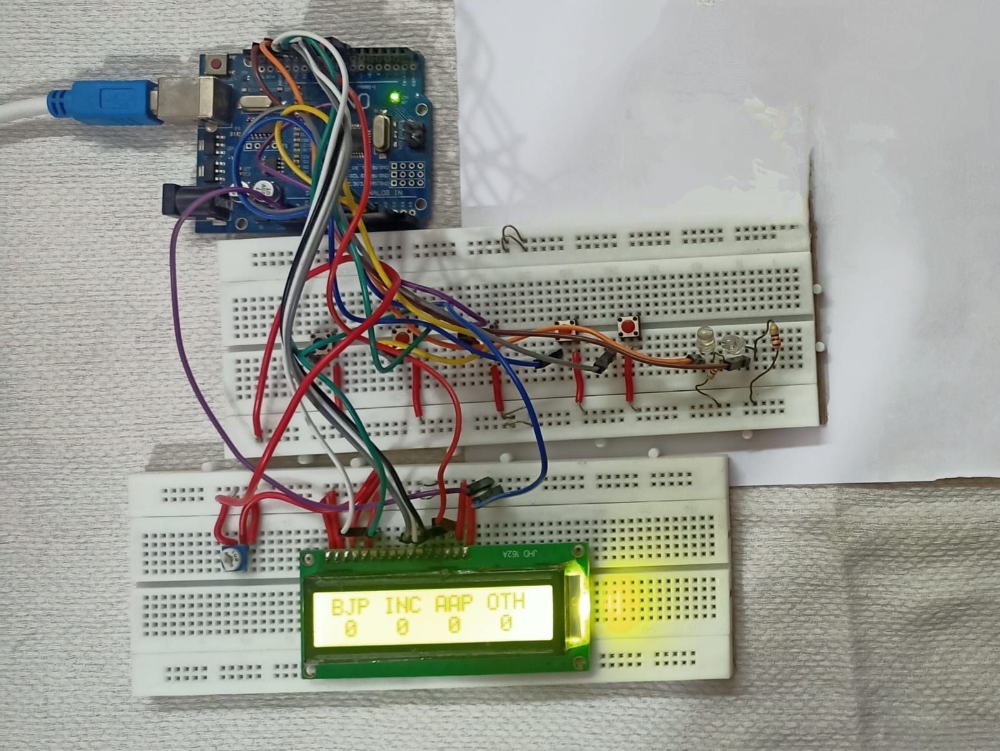
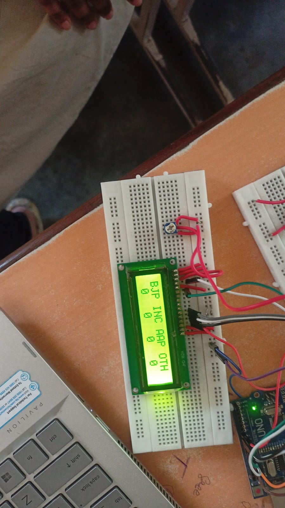

# 🗳️ Electronic Voting Machine (EVM) using Embedded Systems

This project simulates a small-scale **Electronic Voting Machine** using a microcontroller, push buttons, and LCD. It ensures quick, accurate, and secure vote recording — ideal for use in classrooms, student elections, or local clubs.

---

## 🔧 Features

- Push button voting for multiple candidates
- Vote confirmation on 16x2 LCD
- Vote counting and result display
- Simple reset function
- Low-cost components

---

## 🛠 Technologies Used

- Arduino Uno / ATmega328
- Push Buttons
- 16x2 LCD Display
- Embedded C (Arduino IDE)
- Breadboard, wires, resistors

---

## 💻 How It Works

1. Each candidate is assigned a button  
2. Pressing a button records a vote in memory  
3. LCD shows confirmation (e.g., “Vote Recorded”)  
4. Admin button shows vote count on LCD  
5. Reset button clears all votes

---

## 📷 Project Images

### 🔌 Hardware Setup

### 📺 LCD Display Showing Result

---

## 👩‍💻 Developed By

**Meghamala Nunna**  
B.Tech – ECE (2022–2026)  
Sri Vasavi Engineering College

---

## 🔮 Future Scope

- Add biometric voter authentication (e.g., fingerprint scanner)
- Integrate IoT for real-time vote syncing to the cloud
- Develop a mobile/web admin dashboard for monitoring and control

